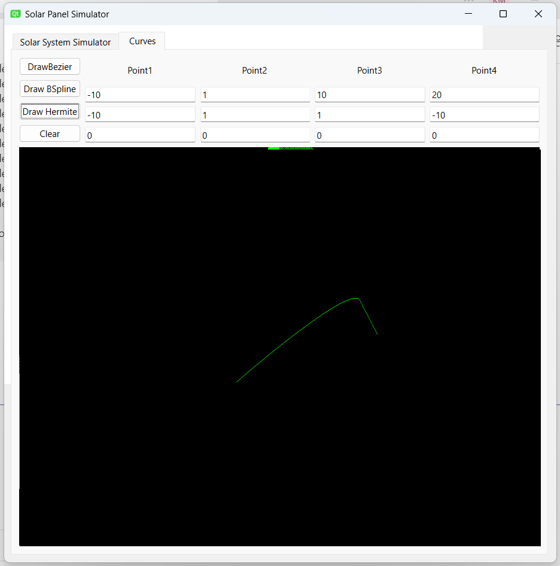

# Hermite Curve Drawing

This project provides a simple implementation of drawing a Hermite curve using the Hermite algorithm. The project includes a `Hermite` class, which allows the creation and rendering of a Hermite curve based on four control points.

## Contents

- [Hermite.h](#hermiteh)
- [Hermite.cpp](#hermitecpp)

## Hermite.h

This header file defines the `Hermite` class, which encapsulates the functionality for creating and drawing a Hermite curve. Key functionalities include:

- Initializing the Hermite curve with four control points.
- Drawing the Hermite curve and adding vertices and colors to the provided vectors.

## Hermite.cpp

This source file contains the implementation of the `Hermite` class. It includes functions for:

- Initializing the Hermite curve with four control points.
- Drawing the Hermite curve using the Hermite blending functions.
- Adding vertices and colors to the provided vectors for rendering.

## Usage

To use the Hermite curve drawing functionality, follow these steps:

1. **Include the necessary files**: Include the `Hermite.h` header file in your project.

   ```cpp
   #include "Hermite.h"
   ```
2. **Create an instance of the Hermite class:**
```cpp
Point3D p0(0.0, 0.0, 0.0);
Point3D p1(1.0, 1.0, 0.0);
Point3D p2(2.0, 0.0, 0.0);
Point3D p3(3.0, 1.0, 0.0);
Hermite hermiteCurve(p0, p1, p2, p3);
```
3. **Draw the Hermite curve:**
```cpp
vector<float> vertices;
vector<float> colors;

hermiteCurve.drawCurve(p0, p1, p2, p3, vertices, colors);
// Render the vertices and colors using OpenGL
```

